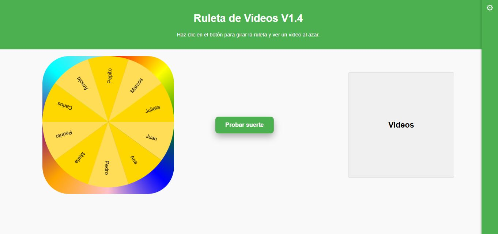
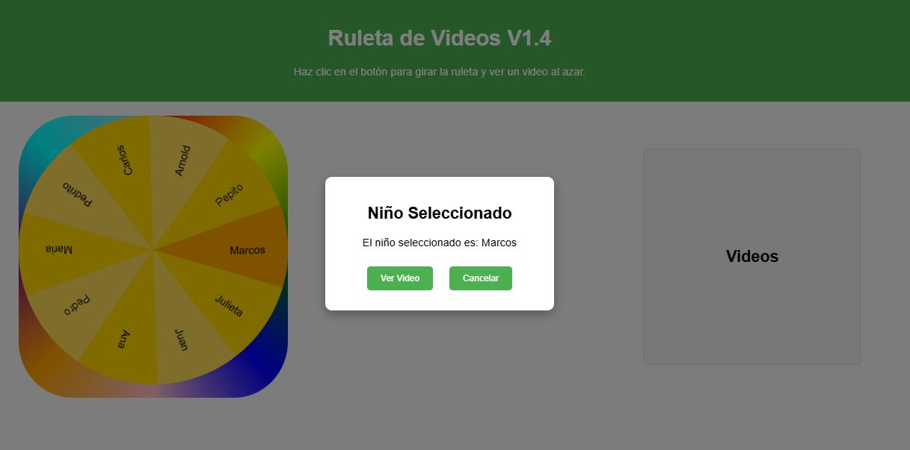
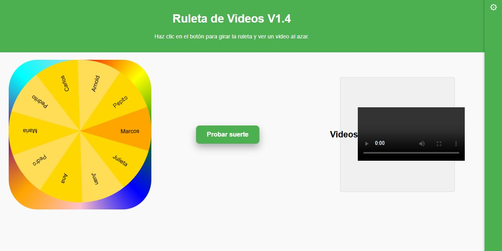
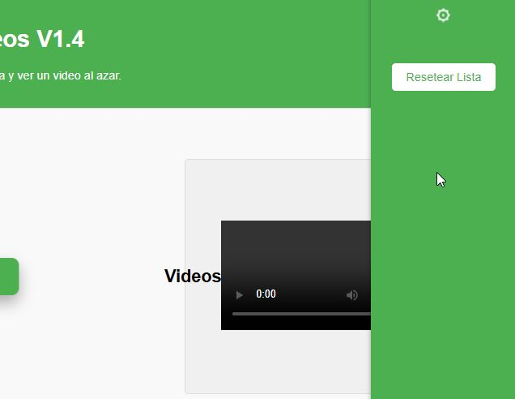
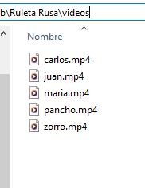

# Ruleta de Videos V1.4
 
Origen: Los padres de los niños en un colegio han grabado distintos videos como regalo para los niños. Se necesita una forma divertida y confiable que permita elegir de forma aleatoria el nombre de un niño y reproducir en la clase su video, tendremos una Ruleta que girará y elegirá aleatoriamente a un niñopara ver posteriormente el video con la particularidad de que no pueda ser elegido de nuevo durante la dinámica.
Los videos estarán localizados dentro de la carpeta de "Videos" en la misma localizaciòn del proyecto.

## Descripción

La aplicación muestra una ruleta con segmentos que representan diferentes niños, cada uno asociado a un video. Al hacer clic en el botón "Probar suerte", la ruleta gira visualemnte y se detiene en un segmento aleatorio, seleccionando así a un niño. Se muestra un modal con el nombre del niño seleccionado y la opción de reproducir su video correspondiente.

La aplicación evita repetir videos ya vistos almacenando la lista de niños seleccionados en el almacenamiento local del navegador (localStorage). También incluye una opción para resetear la lista y comenzar de nuevo.

La aplicación evita repetir videos ya vistos almacenando la lista de niños seleccionados en el almacenamiento local del navegador (localStorage). También incluye una opción para resetear la lista y comenzar de nuevo.

## Características principales

- Ruleta animada que gira y selecciona un segmento aleatorio.
- Modal que muestra el niño seleccionado y permite reproducir su video.
- Reproducción de video integrada en la página.
- Almacenamiento local para evitar repeticiones hasta que se resetee la lista.
- Sidebar con botón para resetear la lista de seleccionados.
- Diseño responsivo y estilizado con CSS.
- Es posible ejecutar este proyecto sin necesidad de instalar ningún componente ni programa, incluso funciona si se descargan los archivos en una USB.

## Archivos principales

- `index.html`: Estructura principal de la página web.
- `style.css`: Estilos y diseño visual de la aplicación.
- `functions.js`: Lógica de la ruleta, selección aleatoria, manejo del modal y reproducción de videos.

## Cómo usar

1. Abrir `index.html` en un navegador web moderno.
2. Hacer clic en el botón "Probar suerte" para girar la ruleta.
3. Ver el modal con el niño seleccionado y elegir "Ver Video" para reproducirlo.
4. Usar el botón "Resetear Lista" en el sidebar para reiniciar la selección y permitir repetir videos.

## Requisitos

- Navegador web moderno con soporte para HTML5, CSS3 y JavaScript.
- Archivos de video ubicados en la carpeta `videos/` con los nombres especificados en `functions.js`.

## Autor

Proyecto creado por Jho Garcia.
